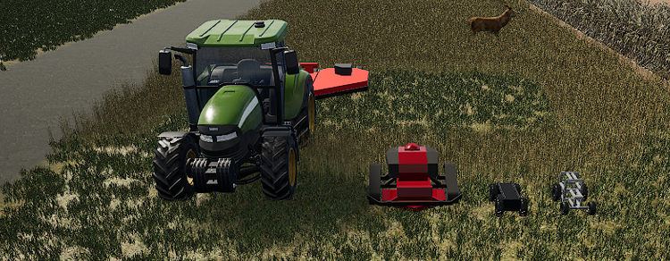

# ROWMow Sim: Digital-Twin Autonomous Roadside Mowing Simulator

Welcome to the **ROWMow Sim**! This project targets development of autonomous mowing system to assist in efficient and safe maintenance of roadside vegetation. The work was funded by Indiana Department of Transportation through the Joint Transportation Research Program and targeted to Indiana roadways for vegetation management.

 <!-- Optional: Add an image banner or logo here -->

---
## Disclaimer
Per [Fab licensing documentation](https://www.fab.com/eula), distribution must go through communications for collaborators to utilize content in good faith. 

  5(a): **Sharing of Content**. Under a Standard License, you may not Distribute Content on a standalone basis to third parties except to your collaborators (either directly or through a third-party repository) who are utilizing the Content in good faith to develop a Project with you or on your behalf. This means, for example, that you may share Content with your employees, affiliates, and contractors in a private online repository while you work on a Project together. Those collaborators you share Content with are not permitted to further Distribute the Content (including as incorporated in a Project) and must delete the Content once it is no longer needed for developing a Project with you or on your behalf. You are responsible for ensuring that any third parties you share Content with comply with the terms of this Agreement. You are solely liable for any violation of this Agreement by collaborators with respect to any Content you share. 

Contacts for communications to become a collaborator are as follows:
- Primary Owner: John Evans - jevansiv@purdue.edu
- Owner: Matt Kraushar - mkraushar@indot.in.gov
- Owner: Greg Shaver - gshaver@purdue.edu
- Developer: Michael Mardikes - mmardike@purdue.edu
- Developer: Nathan Sprague - nspragu@purdue.edu
- Developer: TJ Wiegman - wiegman@purdue.edu
- Developer: Ethan Brown - brow1633@purdue.edu
- Developer: Shreyas Supe - ssupe@purdue.edu

---
## Table of Contents
- [Overview](#overview)
- [Project Goals](#project-goals)
- [Features](#features)
- [Installation](#installation)
- [Usage](#usage)
- [Project Structure](#project-structure)
- [Custom Environment Setup](#custom-environment-setup)
- [Custom Vehicle Setup](#custom-vehicle-setup)
- [Sensor Setup](#sensor-setup)
- [Data Collection](#data-collection)
- [Configuration](#configuration)
- [Results](#results)
- [Contributing](#contributing)
- [License](#license)

---

## Overview
The INDOT Autonomous Mower Project is designed to create an autonomous robotic platform capable of safely and efficiently mowing designated roadside areas. This project uses a combination of **ROS2**, **Unreal Engine**, and **TerraForm Pro** to develop digital-twin roadsides for mowing navigation along a coverage region and obstacle avoidance.

This README provides an overview of the project’s setup, configuration, and usage instructions for contributors and users.

**Additional documentation and details can be found in our following papers:**
- Digital-twin environment generation
  - Mardikes, M., Evans, J., Brown, E., Sprague, N., Wiegman, T., & Shaver, G. (2024). *Constructing Digital-Twin Roadways for Testing and Evaluation of Autonomous Roadside Mowing Vehicles.* Unpublished manuscript.

- ROWMow Sim vehicle configurations and sim2real testing (Nav2 navigation)
  - Mardikes, M., Evans, J., Brown, E., Sprague, N., Wiegman, T., Supe, S., & Shaver, G. (2024). *ROWMow Sim: A Digital-Twin Robotic Simulator for Testing Autonomous Roadside Mowers.* Unpublished manuscript.

- Reinforcement learning based navigation and obstacle avoidance

## Project Goals
- **Real-World Testsites**: Generate real-world locations for simulation testing to target improvements to sim2real transfers.
- **Autonomous Navigation**: Enable autonomous mower research to navigate roadsides using GPS, IMU, and a coupled obstacle detection sensor.
- **Obstacle Detection**: Implement obstacle detection methods with an advanced sensor suite.
- **Data Logging**: Record sensor data for analysis and continuous improvement.
- **Safety Analysis**: Develop safety report from recorded sensor data for analysis by developers.
- **Vehicle Configuration**: Optimize the system based on a developer's vehicle, software, and sensors for maximizing mowing efficiency and safety.

## Features
- **Real-time Navigation**: Uses custom user developed **Nav2** or **RL** methods for autonomous path planning and obstacle avoidance.
- **Sensor Fusion**: Combines data from sensors for positioning and navigation with adjustable sampling rates and noise.
- **Data Recording**: Logs relevant data for later analysis and debugging.
- **Simulation Support**: Offers a high-fidelity Unreal Engine 5.1 simulation for development and testing of vegetation management platforms in a virtual environment.

## Installation

### Prerequisites
- Minimum 75 GB of available storage on SSD
- [ROS2](https://docs.ros.org/en/galactic/index.html) (Recommended Distro from rclUE plugin: Humble)
- Python 3.8+
- CMake
- Dependencies:
  ```bash
  sudo apt install ros-${ROS_DISTRO}-nav2 ros-${ROS_DISTRO}-gazebo-ros
- Packages:
  - [rclUE](https://github.com/rapyuta-robotics/rclUE/tree/UE5_devel_humble)
  - [RapyutaSimulationPlugins](https://github.com/rapyuta-robotics/RapyutaSimulationPlugins/tree/devel)
  - [Fields2Cover](https://github.com/Fields2Cover/Fields2Cover)
  - oscar_ros **(NEED LINK AND REPO SETUP FOR HERE)**

### Recommended Installs
The following are recommended Marketplace assets for advanced vehicle configurations and environment fidelity.
- [Advanced Vehicle System](https://www.fab.com/listings/e1457ad1-297b-4a70-aecb-5c6716d9494f)
- [TerraForm Pro](https://www.terraformpro.com/)
- [Cesium](https://www.fab.com/listings/76c295fe-0dc6-4fd6-8319-e9833be427cd)
- [Megascans]()

## Usage
### First Time Using Simulation:
To build the Unreal Engine project:
  - Open the Unreal Engine project's workspace in vscode
  - Identify and click-on the "Run and Debug" Tab (Left-Hand-Side)
  - Navigate to the "RUN AND DEBUG" drop down menu at the top of the application and select "Generate Project Files (UE5)" from the item list
  - Press the green arrow button to run the project generation
### Launching the Simulation (Example Demonstrations with OSCAR Platform):
To test in a simulated environment:
- **Launch the Unreal Engine Project in vscode**
  - Use: Launch Test_Segment_1 Editor (DebugGame) (UE5)
- **Select the map desired from the content browser**
- **Implement the mowing vehicle into the environment if platform does not already exist in environment**
  - Set the autopossess player to player 0 from disabled if it is disabled
- **Play the simulated environment**
- **Launch the external ros2 connection for the GPS sensor in a terminal:**
```
source ~/oscar_ros/install/setup.bash
ros2 launch oscar_ros launch_sim_gps.launch.py
```
- **Launch the external Nav2 controller in a terminal:**
```
source ~/oscar_ros_ws/install/setup.bash
cd ~/oscar_ros_ws/src/oscar_ros/config/sim
ros2 launch nav2_bringup bringup_launch.py params_file:=./<nav2_param_yaml_file>.yaml map:=../../maps/<map_yaml_file>.yaml use_sim_time:= true
```
  - An example launch commmand used for obstacle avoidance from files in oscar_ros package:
```
ros2 launch nav2_bringup bringup_launch.py params_file:=./nav2_params_pcloud.yaml map:=../../maps/empty_map.yaml use_sim_time:= true
```
- **Launch RViz2 for visualized view of robot's inputs and outputs:**
```
source ~/oscar_ros/install/setup.bash
rviz2
```
  - (Optional) Send goal poses in RViz2
- **(Optional) Run external navigation to send goal poses in a terminal:**
```
source ~/oscar_ros_ws/install/setup.bash
cd /<path_to_waypoint_publisher_file>
python3 <waypoint_publisher_file>.py
```
- **Recording Data**
  - To record a rosbag of sensor data:
```
source ~/oscar_ros_ws/install/setup.bash
ros2 bag record --all
```
  - To record simulation data at end of test:
    - Ensure you are the active as the player in Unreal Engine, F8 to change between, and press "R" on the keyboard.
      - A printout statement confirming that data has been generated should appear on the screen
   
### Real-world deployment (Example Demonstrations with OSCAR Platform):
Testing the virtual model developments in the real-world:
- **First Time Use:**
  - **Have a physical model of the vehicle ready**
    - Includes any necessary hardware components and sensors to perform the necessary inputs and outputs for navigation
    - **Note:** Depending on your onboard computing hardware, you may find some of the desired sample rates are too high
    - **Note:** Verify that all orientations for commands match platform if this was not verified for the virtual model development
      - Always good to double check as well! 
  - **Install the navigation package for the robot onto the onboard computer** (i.e., oscar_ros)

- **Launch the IMU in a new terminal (ZED IMU used):**
```
source ~/oscar_ros_ws/install/setup.bash
ros2 launch oscar_ros zed2i.launch.py
```
- **Launch the robot configuration with GPS position estiamtion in a new terminal:**
```
source ~/oscar_ros_ws/install/setup.bash
ros2 launch oscar_ros launch_robot.launch.py
```
- **Launch the robot configuration with GPS position estiamtion in a new terminal:**
```
source ~/oscar_ros_ws/install/setup.bash
ros2 launch oscar_ros robot.launch.py
```
- **Launch the external Nav2 controller in a terminal:**
```
source ~/oscar_ros_ws/install/setup.bash
cd ~/oscar_ros_ws/src/oscar_ros/config/sim
ros2 launch nav2_bringup bringup_launch.py params_file:=./<nav2_param_yaml_file>.yaml map:=../../maps/<map_yaml_file>.yaml use_sim_time:= true
```
  - An example launch commmand used for obstacle avoidance from files in oscar_ros package:
```
ros2 launch nav2_bringup bringup_launch.py params_file:=./nav2_params_pcloud.yaml map:=../../maps/empty_map.yaml use_sim_time:= true
```
- **Launch the coupled sensors for obstacle avoidance in a terminal:**
  - Launch ouster LiDAR demo command:
```
source ~/oscar_ros_ws/install/setup.bash
ros2 launch oscar_ros ouster.launch.py
```
  - Launch OAK-D stereo demo command:
```
source ~/oscar_ros_ws/install/setup.bash
ros2 launch oscar_ros oakd.launch.py
```
- **Launch RViz2 for visualized view of robot's inputs and outputs:**
```
source ~/oscar_ros/install/setup.bash
rviz2
```
  - (Optional) Send goal poses in RViz2
- **(Optional) Run external navigation to send goal poses in a terminal:**
```
source ~/oscar_ros_ws/install/setup.bash
cd /<path_to_waypoint_publisher_file>
python3 <waypoint_publisher_file>.py
```

- **Record Data**
  - To record a rosbag of sensor data:
```
source ~/oscar_ros_ws/install/setup.bash
ros2 bag record --all
```

## Project Structure
**Unreal Project:** Contains virtual environments, vehicle models, and sensors for developing navigation methods in specific environments and scenarios. This is where your testbed can be augmented for evaluating a vehicle's autonomy to safely navigate within a desired mowing coverage region. Vehicle models include the Evans' lab open-source connected autonomous rover (OSCAR) and RC Mower TK-44E build. Developer's can model and import their own vehicles to this project.

**oscar_ros:** Contains navigation, perception, and control ROS2 launch scripts and interface scripts for the autonomous mower. This is an example of what a navigation software stack will be like (e.g., Nav2) that is provided for the open-source connected autonomous rover (OSCAR). Developers can model off of this structure for their own robot platforms.

**Scripts:** Contains additional supplement scripts for filtering data entries to navigation, such as limiting data inputs to a specified region in the field-of-view of a sensor. These scripts are dependent on the autonomy setups for your navigation package, will vary to your own work.

<!-- **src:** Contains the main ROS2 packages for navigation, perception, and control.
launch: Launch files for simulation and real-world deployment.
config: Configuration files for sensors, navigation parameters, and tuning.
data: Folder for collected datasets, logs, and ROS2 bag files.
scripts: Utility scripts for data processing, analysis, and configuration setup.-->

## Custom Environment Setup


A digital twin environment can be generated with:
  - [TerraForm Pro](https://www.terraformpro.com/)
  - [Cesium ion](https://cesium.com/platform/cesium-ion/)
  - [Point clouds](https://dev.epicgames.com/documentation/en-us/unreal-engine/lidar-point-cloud-plugin-quick-start-guide-in-unreal-engine)

**Note:** Custom environment noise can be added by animals (e.g., [Animal Variety Pack](https://www.fab.com/listings/2dd7964c-a601-4264-a53d-465dcae1644c)) and neighboring vehicles traveling on the road (e.g., [Vehicle Variety Pack](https://www.fab.com/listings/dc1ada50-2523-44b1-b0e2-a72d14076fb4)).

## Custom Vehicle Setup


A custom vehicle can be imported and configured in ROWMow Sim. To do this, the following steps must be performed.
- Produce a CAD (or virtual) model of the vehicle
- Import the model into [Blender](https://www.blender.org/)
- Rig your vehicle with the bones and proper orientation (Here is an example [tutorial](https://www.youtube.com/watch?v=loRhQn1zwpE))
- Export vehicle as FBX from Blender and import vehicle as FBX to Unreal Engine
- Set vehicle physics in Unreal Engine
- Copy over ROS2 configuration blueprint details from OSCAR or other developed platform

**Note:** Advanced models (e.g., tractor with flex-wing mower) require [Advanced Vehicle System](https://www.fab.com/listings/e1457ad1-297b-4a70-aecb-5c6716d9494f) plugin.

## Sensor Setup
Sensors are blueprints in the content browser that can be pulled into the vehicle and configured in the vehicle's blueprint for ROS2 configuration. OSCAS's blueprint can be used for reference to develop custom configurations. These sensors were developed upon [rclUE](https://github.com/rapyuta-robotics/rclUE/tree/UE5_devel_humble) and [RapyutaSimulationPlugins](https://github.com/rapyuta-robotics/RapyutaSimulationPlugins/tree/devel) with added sensor types and noise modeling.

### Sensor options:
 - GPS
 - IMU
 - RGB Camera
 - Depth Camera
 - FLIR Camera
 - Ultrasonic
 - Radar
 - LiDAR


## Data Collection
This project includes modules for recording sensor data:

- **ROS2 Bag:** Record all relevant topics, excluding unnecessary topics.
- **CSV Logging:** Logs GPS, terrain, road entries, and collisions in CSV format for post-analysis.

## Results
Here, you can detail the experimental results of your autonomous mower:

- Mowing coverage performance
- Obstacles avoided and accuracy of path-following
- Safety result summary
- Sim2real transfer

A safety report summary example can be observed in Files/Supplement_Material.docx as supplement material S2.

## Contributing
We welcome contributions! To become a contributor with the full ROWMow Sim package, please contact one of the individuals listed in the [disclaimer](#disclaimer). Contributors must become collaborators for access to the full version, which provides access to all assets and models in the environment. Open contribution from third-parties is not permitted due to Fab's Standard Licensing agreement.

## Reporting Issues
If you encounter any issues, feel free to open a GitHub Issue on our private GitHub Repository.

## Code of Conduct
Collaborators are not allowed to distribute this project to third-parties and may not export models that were provided from Fab, Unreal Engine Marketplace, and Quixel Megascans for external productions.

